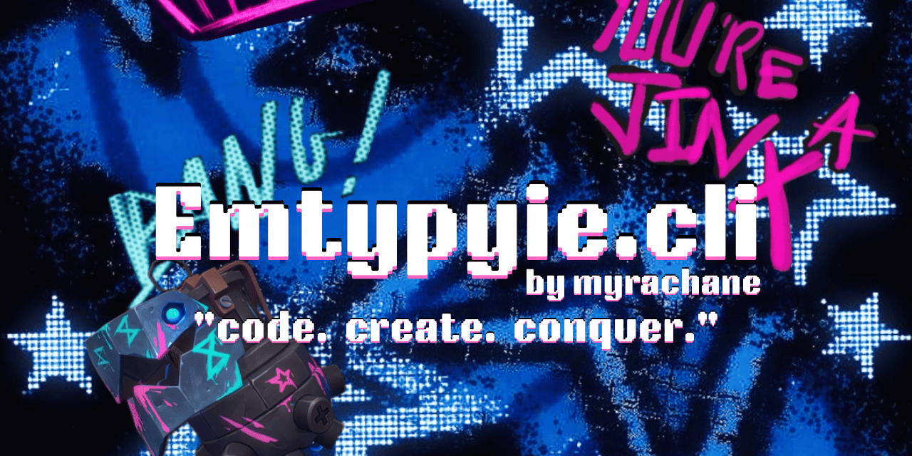

# Emtypyie.cli@v3.0.3



> Package Manager for all of my projects

## Quick install

```sh
# Windows (Winget)
winget install emtypyie.cli

# Windows (Chocolatey)
choco install emtypyie-cli

# npm (all platforms)
npm install -g emtypyie-cli
```

## Launch — C CLI

Once installed, the binary is on your `PATH` as `emtypyie`. Just type it in **Command Prompt, PowerShell, or Windows Terminal**:

```sh
emtypyie
```

This prints the startup boot animation and drops you into the **interactive shell**.

Type `/help` for commands, or `/about` for version info.

To skip the boot animation:

```sh
emtypyie --no-animation
# or
set EMTYPYIE_NO_ANIM=1
```

Direct commands also work without entering the shell, e.g. `emtypyie /list` or `emtypyie /get gcc`.

### Version & Updates

```sh
emtypyie -v          # Show version with ASCII art
emtypyie --version   # Same as -v
emtypyie --upgrade   # Self-update to latest version and restart
```

On every launch, the CLI checks for updates in the background and notifies if a new version is available.

## Launch — GUI (Windows only)

Download `emtypyie.cli-Wrapper.zip` from the release, extract it anywhere, and run:

```sh
emtypyieWrapper.exe
```

On first launch, a desktop shortcut is created automatically. The GUI opens a frameless window with a custom title bar (drag to move, grouped split/settings/win controls). Each tab runs its own C engine session with streaming output and a status bar.

| Feature | Description |
|---------|-------------|
| Multi-tab | Independent engine sessions per tab |
| Streaming | Per-line output (no buffering) |
| Status bar | Shows current command per tab, auto-clears |
| Settings | Accent swatches, font size, env vars |
| Ricing | Background image opacity slider |
| Runtime check | Auto-detects missing C binary and offers download |
| Updates | GitHub release check with integrated download + apply |
| Frameless | Custom title bar with drag, min/max/close |

## Commands

### Core Commands

| Command | Description |
|---------|-------------|
| `/help` | Show help |
| `/list` | List available projects |
| `/get <project>` | Install a project |
| `/get gcc` | Auto-install GCC/G++ compiler |
| `/get larpino@1b` | Download a LLAMA GGUF model and load it |
| `/info <project>` | Show project details |
| `/flash <project>` | Re-download latest version |
| `/rm <project>` | Remove project |
| `/theme <name>` | Change color theme |
| `/bf` | System info screen (bakafetch) |
| `/docs <project>` | Open project docs |
| `/shell` | Interactive mode |
| `/larpino enable\|disable\|status` | inference engine |
| `/clear` | Clear screen |
| `/wiki` | Open wiki.emtypyie.in |
| `/changelog` | Open GitHub releases |
| `/about` | About emtypyie |
| `/version` | Show version with ASCII art |
| `/update` | Check for CLI updates |
| `/upgrade` | Alias for --upgrade |
| `/exit` / `/quit` | Exit interactive shell |

### Project Subcommands

After installing a project (`/get <project>`), you can manage it with subcommands:

| Command | Description |
|---------|-------------|
| `/<project> --upgrade` | Upgrade project to latest version |
| `/<project> -v` | Show project version and package managers |
| `/<project> rebuild` | Re-download and verify integrity |
| `/<project> verify` | Check file integrity (SHA256) |
| `/<project> deps [action]` | Manage dependencies (install, update, list, check) |
| `/<project> info` | Show detailed project info (tech stack, deps, etc.) |

### Project Templates

Create new projects from templates:

| Command | Description |
|---------|-------------|
| `/new <template> <name> [dir]` | Create project from template |
| `/init <template> <name> [dir]` | Alias for /new |
| `/new list` | List available templates |

**Available templates:** `python-cli`, `node-cli`, `rust-cli`

### Dependency Management

For installed projects with declared dependencies:

```sh
/<project> deps install   # Install all dependencies
/<project> deps update    # Update to latest versions
/<project> deps list      # List declared dependencies
/<project> deps check     # Verify all dependencies satisfied
```

Supports Python (pip), Node.js (npm), Rust (cargo), and system binaries.

### Issues

```sh
/issue <project>   # Open emtypyie.in/issues/<project>
```

## Structure

| Path | Description |
|------|-------------|
| `archive/vX.Y.Z/Root4c/`    | C CLI — portable single binary (primary, recommended) |
| `archive/vX.Y.Z/Root4node/` | Node.js CLI — published to npm |
| `archive/vX.Y.Z/Root4gui/`  | Electron GUI wrapper (frameless, multi-tab, streaming) |
| `mainsite/`  | Website landing pages |
| `manifests/` | Winget package manifests |
| `choco/`     | Chocolatey package |

## C CLI (Root4c)

Single-binary CLI written in C11/C++17, no runtime dependencies.

- **Build:** `cmake -B build && cmake --build build` (MinGW-w64 / MSVC)
- **Themes:** slate, green, amber, violet, cyan
- **Bakafetch:** Unicode/braille art system info screen
- **Larpino:** Built-in LLM inference engine
  - Loads GGUF format LLAMA models (Q4_0, Q4_1, Q5_0, Q5_1, Q8_0, F16, F32)
  - BPE tokenizer with merge rules
  - KV-cached transformer (RoPE, SwiGLU, RMS norm, GQA)
  - Top-k / temperature sampling
  - `/larpino enable` enters chat mode in the interactive shell
  - `/get larpino@1b` downloads a model from the CDN
- **Auto-update check:** Background check on startup, `--upgrade` to update
- **Project subcommands:** `--upgrade`, `-v`, `rebuild`, `verify`, `deps`, `info`
- **Templates:** `/new`, `/init` with python-cli, node-cli, rust-cli
- **No args:** opens interactive shell (with startup boot animation)

## Node.js CLI (Root4node)

Published to npm as `emtypyie-cli`. Feature parity with C CLI.

- **Install:** `npm install -g emtypyie-cli`
- **Run:** `emtypyie` or `npx emtypyie-cli`
- **Package:** `pkg` compiles to single executable
- Same commands, subcommands, templates, and integrity verification

## GUI (Root4gui) — emtypyie.cli-Wrapper

Electron-based GUI wrapper for the C CLI, targeting Windows x64.

- **Wrapper version:** 1.0.1
- **Executable:** `emtypyieWrapper.exe`
- **Engine:** Electron 32 + asar packaging
- **Frameless window:** custom title bar with drag, 46x30px window buttons
- **Multi-tab:** each tab spawns its own C engine process (child_process.spawn)
- **Streaming output:** per-line DOM writes — no buffer, visible during long operations
- **Status bar:** per-tab footer showing current command + animated dot
- **Settings panel:** accent swatches, font size, env variables
- **Ricing section:** background image opacity slider (0–100%, persisted to localStorage)
- **Runtime check:** on startup, verifies `emtypyie.exe` exists; if missing, prompts to download from GitHub
- **Update mechanism:** checks GitHub releases, downloads + extracts `emtypyie.exe` from asset zip
- **Icon:** custom logo.ico, set as EXE and window icon
- **Packaging:** `electron-packager` with `--asar`, `--extraResource` for the C binary

## Release artifacts

Each GitHub release ships three Windows artifacts:

| ZIP | Contents | Source |
|-----|----------|--------|
| `emtypyie-cli-windows-x64-3.0.3.zip` | `emtypyie.exe` | Node.js (pkg) — npm release |
| `emtypyie-cli-native-windows-x64-3.0.3.zip` | `emtypyie.exe` | C native build |
| `emtypyie.cli-Wrapper.zip` | `emtypyieWrapper.exe` + resources | Electron GUI wrapper |